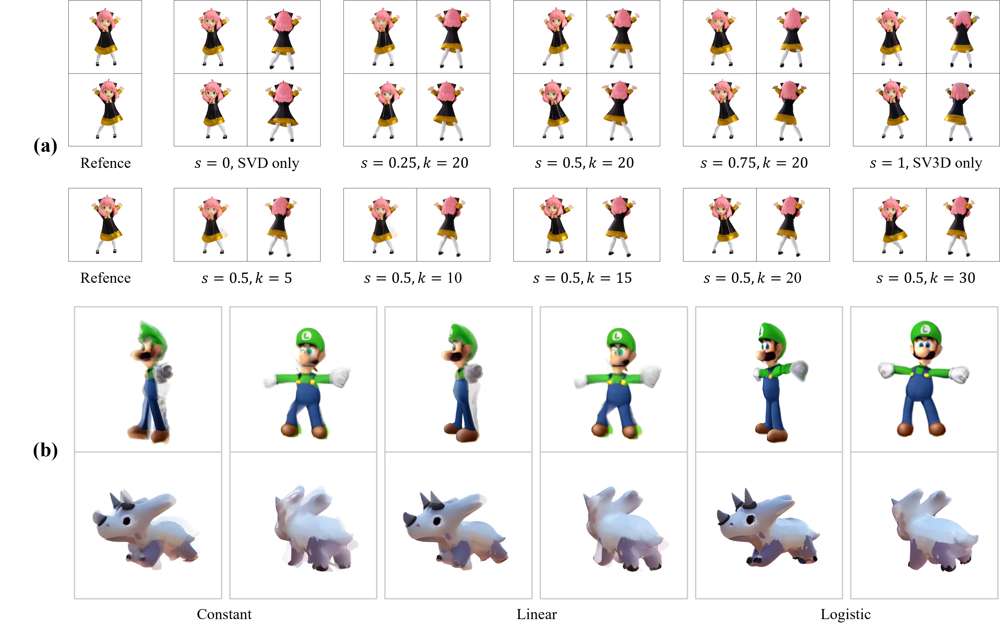

# Diffusion²: Dynamic 3D Content Generation via Score Composition of Orthogonal Diffusion Models
[Paper](https://arxiv.org/abs/2404.02148)
> [**Diffusion²: Dynamic 3D Content Generation via Score Composition of Orthogonal Diffusion Models**](https://arxiv.org/abs/2404.02148),            
> Zeyu Yang*, Zijie Pan*, [Chun Gu](https://sulvxiangxin.github.io), [Li Zhang](https://lzrobots.github.io)  
> **Fudan University**  
> **Arxiv preprint**

**This repository is the official implementation of "Diffusion²: Dynamic 3D Content Generation via Score Composition of Orthogonal Diffusion Models".** In this paper, we propose to achieve 4D generation from directly sampling the dense multi-view multi-frame observation of dynamic content by composing the estimated score of pretrained video and multi-view diffusion models that have learned strong prior of dynamic and geometry. 

## 🛠️ Pipeline
<div align="center">
  
</div><br/>

## Get started

### Environment

1. Clone this repo and `cd` into it.

```shell
git clone https://github.com/fudan-zvg/diffusion-square.git
cd diffusion-square
```

2. Create the virtual environment with torch.

```shell
conda create -n dxd python=3.10
conda activate dxd

# Install torch: tested on torch 2.0.1 & CUDA 11.8.
conda install pytorch==2.0.1 torchvision==0.15.2 torchaudio==2.0.2 pytorch-cuda=11.8 -c pytorch -c nvidia
```

3. Install other required packages.

```shell
pip install -r requirements.txt
```

4. Download the pretrained safetensors of the [multi-view diffusion model](https://huggingface.co/stabilityai/sv3d/blob/main/sv3d_p.safetensors) and the [video diffusion model](https://huggingface.co/stabilityai/stable-video-diffusion-img2vid-xt/blob/main/svd_xt.safetensors) to `checkpoints/`.

### Data preparation

The inference script will automatically perform rescaling and recentering on the input images, with optional background removal beforehand for non-RGBA images, eliminating the need for manual processing. Therefore, there is no need for too much manual processing. Users just need to ensure that the input for the single-view video is organized as the following structure:

```shell
video_folder
├── 0.png
├── 1.png
├── 2.png
└── ...
```

### Usage

**STAGE-1: Multi-view videos generation**

After the installation, you can sample the synchronized multi-view videos using:

```shell
PYTHONPATH="." MASTER_ADDR=localhost MASTER_PORT=12345 python main.py \
                    --input_path SAMPLE_NAME \
                    --elevations_deg 0.0 \
                    --image_frame_ratio 0.9
```

`SAMPLE_NAME` should be the path of input image or video folder for text-to-4D and video-to-4D generation respectively. 

**STAGE-2: 4D reconstruction from synthesized videos**

Once the dense multi-view multi-frame images are generated, many off-the-shelf 4D reconstruction pipelines can be employed to obtain continuous 4D assets. We are working on integrating a simplified version of [4DGS](https://github.com/fudan-zvg/4d-gaussian-splatting) into this repo.

## 📊 Results

### 🎞️ Video Results

https://github.com/user-attachments/assets/0daf1116-e5b7-4c74-8558-dc36a0871553

### 🖼️ Image-to-4D Generation

<div align="center">
  
</div><br/>

### 🖼️ 4D Generation from Single-view Video 

<div align="center">
  
</div><br/>

### 🖼️ Animating Static 3D assets

<div align="center">
  
</div><br/>

### 🖼️ Ablation


https://github.com/user-attachments/assets/cb52f193-d806-4290-99cb-60c70dc62608


<div align="center">
  
</div><br/>

## 📜 Reference
```bibtex
@article{yang2024diffusion,
  title={Diffusion²: Dynamic 3D Content Generation via Score Composition of Orthogonal Diffusion Models},
  author={Yang, Zeyu and Pan, Zijie and Gu, Chun and Zhang, Li},
  journal={arXiv preprint 2404.02148},
  year={2024}
}
```

## 😄 Acknowledgements

This repo is built on the https://github.com/Stability-AI/generative-models.

- We sincerely thanks to [Yurui Chen](https://github.com/519401113) for the invalueble discussing on this work.
